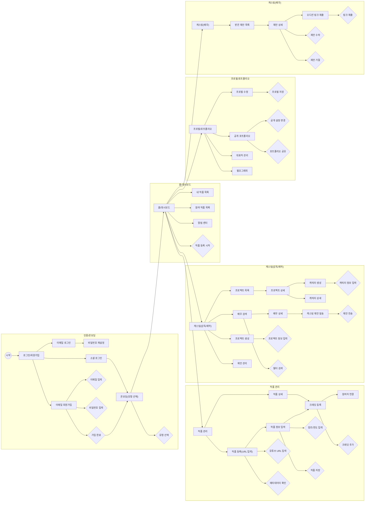

```mermaid
flowchart LR

  subgraph s1 ["인증/온보딩"]
    n1(("시작"))
    n2["로그인/회원가입"]
    n3["이메일 회원가입"]
    n4["이메일 로그인"]
    n5["비밀번호 재설정"]
    n6["소셜 로그인"]
    n7["온보딩(유형 선택)"]
    n8{"이메일 입력"}
    n9{"비밀번호 입력"}
    n10{"가입 완료"}
    n11{"유형 선택"}
  end

  subgraph s2 ["홈/대시보드"]
    n12["홈/대시보드"]
    n13["내 작품 목록"]
    n14["참여 작품 목록"]
    n15["알림 센터"]
    n16{"작품 등록 시작"}
  end

  subgraph s3 ["프로필/포트폴리오"]
    n17["프로필/포트폴리오"]
    n18["프로필 수정"]
    n19["공개 포트폴리오"]
    n20["대표작 관리"]
    n21["필모그래피"]
    n22{"프로필 저장"}
    n23{"공개 설정 변경"}
    n24{"포트폴리오 공유"}
  end

  subgraph s4 ["작품 관리"]
    n25["작품 관리"]
    n26["작품 등록(URL 입력)"]
    n27["작품 정보 입력"]
    n28["작품 상세"]
    n29["크레딧 등록"]
    n30["참여자 연결"]
    n31{"유튜브 URL 입력"}
    n32{"메타데이터 확인"}
    n33{"장르/연도 입력"}
    n34{"크레딧 추가"}
    n35{"작품 저장"}
  end

  subgraph s5 ["캐스팅(감독/제작)"]
    n36["캐스팅(감독/제작)"]
    n37["프로젝트 목록"]
    n38["프로젝트 생성"]
    n39["프로젝트 상세"]
    n40["캐릭터 생성"]
    n41["캐릭터 상세"]
    n42["배우 검색"]
    n43["배우 상세"]
    n44["캐스팅 제안 발송"]
    n45["제안 관리"]
    n46{"프로젝트 정보 입력"}
    n47{"캐릭터 정보 입력"}
    n48{"필터 검색"}
    n49{"제안 전송"}
  end

  subgraph s6 ["캐스팅(배우)"]
    n50["캐스팅(배우)"]
    n51["받은 제안 목록"]
    n52["제안 상세"]
    n53["오디션 링크 제출"]
    n54{"제안 수락"}
    n55{"제안 거절"}
    n56{"링크 제출"}
  end

  n1 --> n2
  n2 --> n3
  n2 --> n4
  n2 --> n6
  n3 --> n8
  n3 --> n9
  n3 --> n10
  n4 --> n5
  n10 --> n7
  n6 --> n7
  n7 --> n11
  n7 --> n12
  n12 --> n13
  n12 --> n14
  n12 --> n15
  n12 --> n16
  n12 --> n17
  n12 --> n25
  n12 --> n36
  n12 --> n50
  n17 --> n18
  n17 --> n19
  n17 --> n20
  n17 --> n21
  n18 --> n22
  n19 --> n23
  n19 --> n24
  n25 --> n26
  n25 --> n28
  n26 --> n31
  n26 --> n32
  n26 --> n27
  n27 --> n33
  n27 --> n29
  n29 --> n34
  n29 --> n30
  n27 --> n35
  n28 --> n29
  n36 --> n37
  n36 --> n38
  n36 --> n42
  n36 --> n45
  n37 --> n39
  n38 --> n46
  n39 --> n40
  n39 --> n41
  n40 --> n47
  n42 --> n48
  n42 --> n43
  n43 --> n44
  n44 --> n49
  n50 --> n51
  n51 --> n52
  n52 --> n54
  n52 --> n55
  n52 --> n53
  n53 --> n56
```
